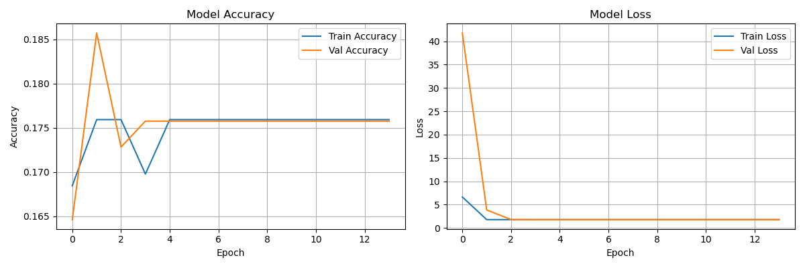

# PCB Defect Detector (Failed at beginner level, will come back with experience.)

Detecting defects in printed circuit boards using Convolutional Neural Network with softmax activation function.

Dataset source:
https://www.kaggle.com/datasets/norbertelter/pcb-defect-dataset

## Lessons Learned (Failed)
- Acheived 17% accuracy
- Valuable learning experience for this failure
- Dataset has small defects (5 - 10 pixels) 
- Identified that defect localization + cropping would be needed

## Progress
- [x] Dec 29: Dataset loaded, visualized 6 defect types, categorize 6 defect types
- [x] Dec 30: Build a local data loader, Split data into train and test sets, Visualize batch of images
- [x] Dec 31: Create a simple CNN training and evaluate the model. Analyze problems -> think of solutions
- [ ] Next: Come back with experience, analyze and finish off this project.

## Defect Types
- Missing hole
- Open circuit  
- Short circuit
- Spur
- Spurious copper
- Mouse bite

### Option 1: Using Conda (Recommended)

```bash
conda create -n pcb_detector python=3.10 -y
conda activate pcb_detector
pip install -r requirements.txt
```

### Option 2: Using Python venv

```bash
python -m venv venv
# Windows
venv\Scripts\activate
# macOS / Linux
source venv/bin/activate
pip install -r requirements.txt
```

---

## Usage

### 1. Categorize the dataset

Run the script below to organize PCB images into folders based on defect type:

```bash
python categorize_data.py
```

After running the script, the dataset will be structured for training and evaluation.

### 2. Run a simple CNN to train the model

```bash
python simple_cnn.py
```
## Model Result

